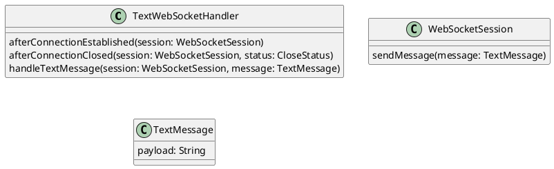
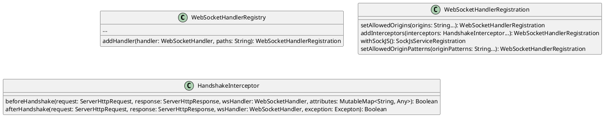

# Demo WS Chat

This repository is intend to demonstrate basic of websocket programming in spring boot. 

Reactive folder demonstrates websocket support in reactive spring with netty.  I think spring support only normal websocket in netty.  To get richer websocket support, tomcat would be a better choice.  In richer websocket support, it includes standard websocket, sockjs with fallback and stomp.

## Spring WebSocket with Tomcat

### Required Dependencies

```xml
<dependency>
    <groupId>org.springframework.boot</groupId>
    <artifactId>spring-boot-starter-web</artifactId>
</dependency>
<dependency>
    <groupId>org.springframework.boot</groupId>
    <artifactId>spring-boot-starter-websocket</artifactId>
</dependency>
```

### Standard WebSocket

To handle websocket request, we will need to implement a handler extending TextWebSockethandler and register the handler to WebSocketHandlerRegistry.

#### Implementing WebSocket Handler



##### afterConnectionEstablished

This callback will be called after websocket client connected to the server.  We can use it to get WebSocketSession information.

##### afterConnectionClosed

This will be called during client is disconnecting.  We can also use it to get WebSocketSession information.

##### handleTextMessage

This will be called during the message is receiving.

#### Register Handler with WebSocketHandlerRegistry



##### setAllowedOrigins

For CORS supporting.

##### addInterceptors

Interceptor for reading path or query string.

```plantuml
participant "On Start" as OnStart
participant "registry:WebSocketHandlerRegistry" as registry
participant WebSocketConfigurer as webSocketConfig
OnStart -> registry: new
OnStart -> webSocketConfig: registerWebSocketHandlers(registry) 
create myWebSocketHandler
webSocketConfig -> myWebSocketHandler: new
webSocketConfig -> registry: addHandler(myWebSocketHandler)
webSocketConfig --> OnStart
```

```kotlin
@Configuration
@EnableWebSocket
class WebSocketConfig: WebSocketConfigurer {
    @Autowired
    private lateinit var chatSocketHandler: ChatSocketHandler

    override fun registerWebSocketHandlers(registry: WebSocketHandlerRegistry) {
        registry.addHandler(chatSocketHandler, "/ws/greetings")
            .addInterceptors(PathSuffixInterceptor())
            .setAllowedOrigins("*")
    }
}
```

### SockJS with fallbacks

SockJS is a protocol to enable websocket with fallbacks.  In case of websocket connection failure, it can fallback to iframe and xhr.

We can enable SockJS support by calling sockJS().  However, if you want to allow * for CORS, you will need to use setAllowedOriginPatterns(..) instead of setAllowedOrigins(..).

```kotlin
@Configuration
@EnableWebSocket
class WebSocketConfig: WebSocketConfigurer {
    @Autowired
    private lateinit var chatSocketHandler: ChatSocketHandler

    override fun registerWebSocketHandlers(registry: WebSocketHandlerRegistry) {
        registry.addHandler(chatSocketHandler, "/sockjs/greetings")
            .setAllowedOriginPatterns("*")
            .addInterceptors(PathSuffixInterceptor())
            .withSockJS()
    }
}
```

### Stomp

Stomp is a pub/sub protocol can run on top of SockJS.  Since websocket does not define specification regarding how client and server are communicating e.g. message format, Stomp is created as subprotocol for websocket.  It uses pub/sub liked design.

#### Register Stomp Endpoints

```plantuml
class WebSocketMessageBrokerConfigurer {
    registerStompEndpoints(registry: StompEndpointRegistry)
    configureMessageBroker(registry: MessageBrokerRegistry)
    configureClientInboundChannel(registration: ChannelRegistration)
}

class StompEndpointRegistry {
    addEndPoint(paths: String...): StompWebSocketEndpointRegistration
}

class StompWebSocketEndpointRegistration {
    addInterceptors(interceptors: HandshakeInterceptor...): StompWebSocketEndpointRegistration
    withSockJS(): SockJsServiceRegistration
}

class MessageBrokerRegistry {
    enableSimpleBroker(destinationPrefixes: String...): SimpleBrokerRegistration
    setApplicationDestinationPrefixes(prefixes: String...): MessageBrokerRegistry
    setUserDestinationPrefix(destinationPrefix: String): MessageBrokerRegistry
}
```

##### registerStompEndpoints

We will register stomp connection path in this method.

##### configureMessageBroker

Publish/Subscribe paths are setting in this method by using MessageBrokerRegistry.

###### registry.setApplicationDestinationPrefixes("/app")

This is prefix to send message endpoint in the client.

```kotlin
@Configuration
@EnableWebSocketMessageBroker
class WebSocketMessageConfig: WebSocketMessageBrokerConfigurer {
    ...
    override fun configureMessageBroker(registry: MessageBrokerRegistry) {
        registry.enableSimpleBroker("/queue", "/topic")
        registry.setApplicationDestinationPrefixes("/app")
        registry.setUserDestinationPrefix("/user")
    }
}

@Controller
class StompController {

    @MessageMapping("/stomp/greetings")
    fun greetings(accessor: SimpMessageHeaderAccessor, message: String): String {
        log.info("## ${accessor.user?.name} ##")
        return "Hello ${message}"
    }
}
```

Client will need to send message to /app/stomp/greetings

###### registry.setUserDestinationPrefix("/user")

Client will need to subscribe for /user/queue/message for receiving user message (/queue/message cannot be changed).

###### registry.enableSimpleBroker("/queue", "/topic")

Endpoint for client subscribing.  This is for broadcast message.

#### Stomp Message Handler

```kotlin
@Controller
class StompController {

    @MessageMapping("/stomp/greetings")
    fun greetings(accessor: SimpMessageHeaderAccessor, message: String): String {
        return "Hello ${message}"
    }

    @Autowired
    private lateinit var messageSendingOperations: MessageSendingOperations<String>

    @Scheduled(initialDelay = 0, fixedDelay = 10000)
    fun sendPeriodicMessages() {
        val date = SimpleDateFormat("yyyy-MM-dd HH:mm:ss.SSS", Locale.US).format(Date())
        val message = "Hello from Stomp at $date"
        this.messageSendingOperations.convertAndSend("/topic/stomp/periodic", message)
    }

    @Autowired
    private lateinit var simpMessagingTemplate: SimpMessagingTemplate

    @Scheduled(initialDelay = 0, fixedDelay = 10000)
    fun sendPeriodicUserMessages() {
        val date = SimpleDateFormat("yyyy-MM-dd HH:mm:ss.SSS", Locale.US).format(Date())
        userList.list.forEach {
            val message = "Hello $it from Stomp at $date"
            this.simpMessagingTemplate.convertAndSendToUser(it, "/queue/message", message)
        }
    }
}
```
